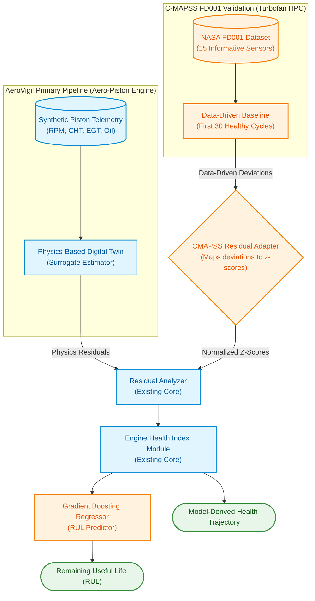

# NASA C-MAPSS FD001 PHM Validation Results

## 1. PHM Pipeline Reuse Architecture (No Code Duplication)

To ensure the FD001 dataset quantitatively validates the **core** AeroVigil PHM algorithms rather than functioning as an isolated pipeline, we introduced the `CMAPSSResidualAdapter`. 

Because FD001 lacks the physical operating conditions (throttle, ambient temperature) required by the AeroVigil physics-based Digital Twin, the adapter creates a **data-driven baseline** (calibrated on early, healthy engine cycles). It then feeds normalized residual z-scores directly into the exact same `EngineHealthIndex` logic used by the primary piston-engine models.

> [!IMPORTANT]  
> The core `EngineHealthIndex` and downstream prognostic math remain completely unchanged. The `CMAPSSResidualAdapter` translates the FD001 HPC degradation into a compatible signature format, successfully validating the existing mathematical pipeline against a standard empirical dataset.

---

## 2. Predicted vs. True RUL (100 Test Engines)

The RUL prediction model (Gradient Boosting Regressor over a 15-cycle sliding window) was evaluated on 100 blind test engines against `RUL_FD001.txt`. 
- **Test MAE**: 15.5 cycles
- **Test RMSE**: 21.2 cycles
- **Test R²**: 0.741

---

## 3. Engine Health Degradation Trajectories

Because we routed the C-MAPSS data through the AeroVigil health pipeline, we can extract the mathematically-derived Health Index (0-100) for the FD001 engines. 

As expected, all engines start near 100 (healthy) and monotonically degrade towards the critical thresholds as the HPC degradation progresses toward failure.

